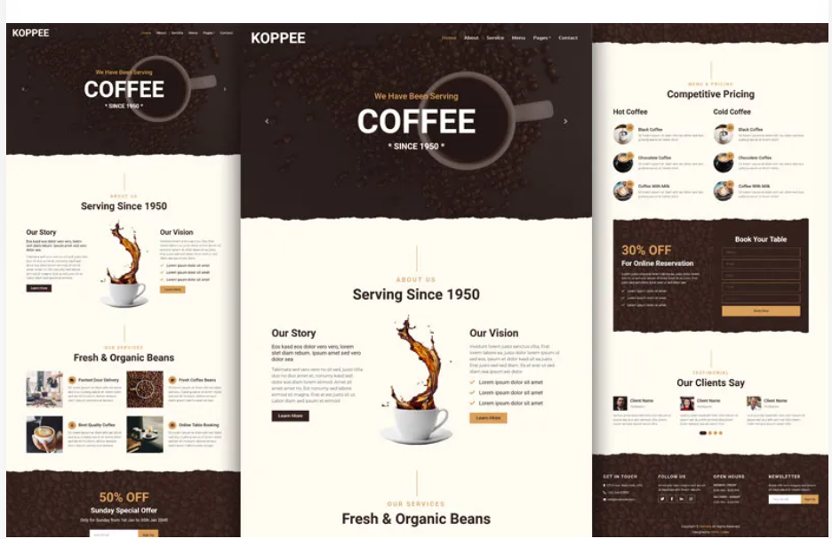

# GEM-Coffee ☕

A modern, responsive coffee shop website built with **Next.js** and styled based on the **KOPPEE Bootstrap template**. Designed for coffee shops, cafés, bakeries, pastry stores, and other food-related businesses.

## 🚀 Demo

> Coming soon…

## 📦 Tech Stack

- [Next.js 13](https://nextjs.org/)
- [React 18](https://reactjs.org/)
- [Bootstrap 5](https://getbootstrap.com/)
- [React Hook Form](https://react-hook-form.com/)
- [Yup](https://github.com/jquense/yup) / [Zod](https://zod.dev/) for schema validation
- [React Toastify](https://fkhadra.github.io/react-toastify/) & [React Hot Toast](https://react-hot-toast.com/)
- [FontAwesome](https://fontawesome.com/) icons
- [Swiper.js](https://swiperjs.com/) for responsive sliders
- [JSON Server](https://github.com/typicode/json-server) for mock backend

---

## 📁 Features

- Fully responsive design based on the KOPPEE HTML template
- Multi-page layout:
  - Home
  - About
  - Services
  - Menu
  - Reservation
  - Testimonial
  - Contact
- Dropdown navigation menu
- Booking form for table reservations
- Product listing section with pricing
- Animated testimonial slider
- Toast notifications for user interactions
- Fully styled components and transitions
- Simple backend simulation with JSON Server

---

## 🛠️ Installation

### 1. Clone the Repository

```bash
git clone https://github.com/your-username/next-coffee.git
cd next-coffee


🌟 KOPPEE Template Info
This project is adapted from the KOPPEE HTML5 Template, a free Bootstrap 4-based design ideal for food and beverage businesses.

KOPPEE Highlights
Built with Bootstrap 4

Valid HTML5 & CSS3

Mobile-first responsive design

Font Awesome Icons

Google Fonts

SASS supported

Animated carousels and buttons

Table booking form, contact form

Dropdown navigation

Browser compatible and SEO-friendly


📸 Screenshots



🧾 License
This project is based on a free HTML template and is used here for educational and non-commercial purposes.

🤝 Contributions
Feel free to fork the repo, submit issues, or make pull requests to improve the project.
KOPPEE is a free coffee shop HTML template designed for coffee shops, ice cream shops, bakeries, cakes & bread shops, pastry shops, cookies shops, restaurants, cafeteria, bar, yogurt, and other similar restaurant & food-related businesses. If you own any restaurant-related businesses, you need this free HTML5 template to create a professional and appealing website that can make an amazing impression on your potential customers. Let’s go into the details.

KOPPEE – free coffee shop Bootstrap website template is created with the Bootstrap v4 CSS framework. The template is fully customizable and very easy to use. You will find developer-friendly and well-commented HTM5 & CSS3 code that will help you to create your own coffee shop business website easily within a very quick time. This free coffee shop HTML template is fully responsive and it works perfectly on various displays and resolutions from regular desktop screens to tablets, iPods, iPhones, and small mobile devices.

KOPPEE – free coffee shop HTML website template comes with a lot of amazing features. First of all, it is a multipage HTML website solution. The template includes more than 7 HTML5 pre-built pages. You can present and sort any type of information using these pre-designed pages. You can also list all your coffee products and price with a nicely designed section. A booking form is also designed for table booking. The template offers many awesome features to create a fully functional website.

Features of this free coffee shop HTML template
Valid HTML5 and CSS3
SASS supported coding
Bootstrap CSS framework
Google web font integrated
Free Font Awesome icon font
CSS3 animation and hover effects
Developer friendly and well-commented code
Desktop, tablets, iPods, and mobile-friendly layout
Compatible with all major website browsers
Total 7 pre-defined HTML5 template files included
Suited for both single-page and multi-page websites
Mobile friendly and dropdown navigation bar
Full-width and fully responsive header carousel
Sign up, table booking, and newsletter form
Fully functional date and time input
Two-column product list with price
Responsive testimonial carousel
Animated “Back to Top” button
Ajax and PHP contact form
